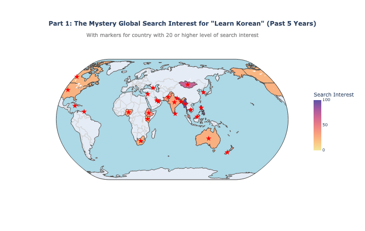
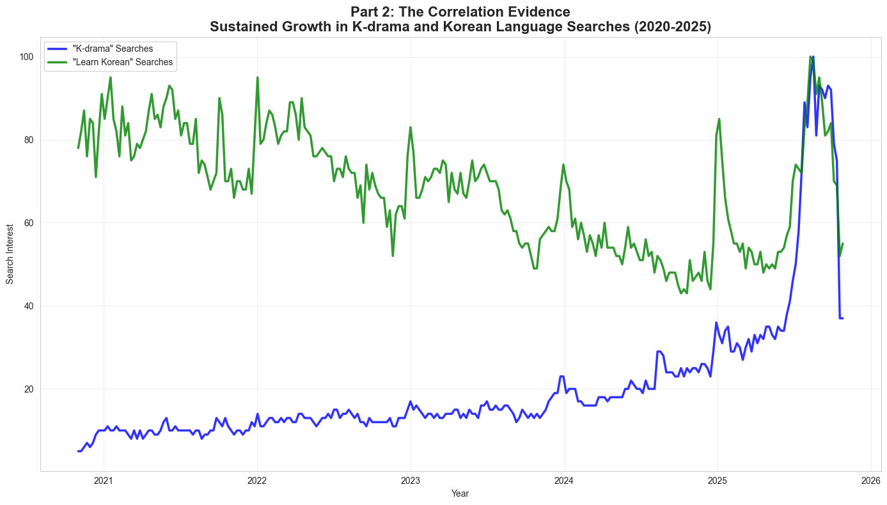
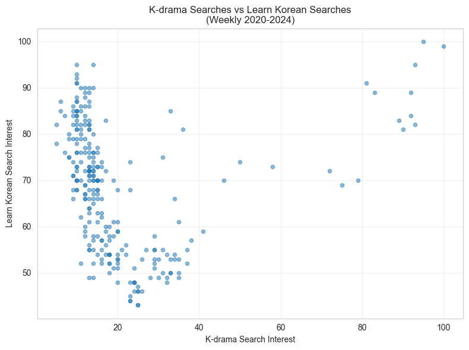
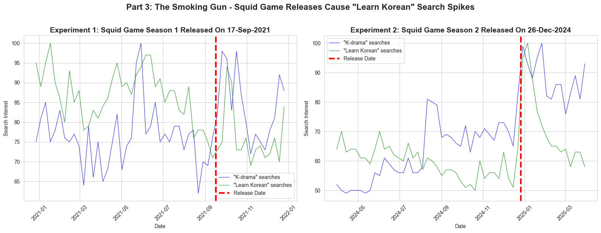
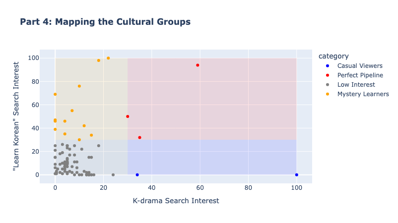

# 🦑 The Squid Game Effect: A Data Analysis on Global Interests in Learning Korean and K-Dramas
This repository contains a data analysis project looking into the effects of entertainment exports from Korean on the global interest in learning the Korean language. The project aims to also look specifically at the impact of Squid Game season 1 and Squid Game Season 2 on the global interest in learning korean language.

The project uses data Google Trends data, Duolingo language report (2024) and MyDramaList from Kaggle.

# Project Description
For decades, language learning was predictable: English, Spanish and French were the languages of choice. However, in 2018, Duolingo's data detectives spotted an anomaly. They noticed that interests in Korean culture and language are surging in countries with no historical ties to Korea.

***Their hypothesis?*** The K-pop and K-drama effect.  Duolingo began weaving famous K-drama catchphrases into their Korean lessons. Their latest campaign of "Learn Korean or Else" was a partnership with Netflix in late 2024 with the release of "Squid Game Season 2". [source: Duolingo Owl joins Squid Game, 10 Dec 2024](https://investors.duolingo.com/news-releases/news-release-details/duolingo-and-netflix-partner-launch-learn-korean-or-else)

This project aims to start on a data trail to see if this is just a corporate intuition based on fads or that binge-watching K-drama is indeed becoming the world's newest Korean classrooms.

## Project Links
* [Github repo](https://github.com/HaveTimeDrinkTea/squidgameeffect)
* [Google slides](https://docs.google.com/presentation/d/1CNAiHM8ZAb_1uJD6XX0eqXvABkgqofNr/edit?usp=sharing&ouid=115645776576726252431&rtpof=true&sd=true)
* [Kanban Board on Trello](https://bit.ly/3LGtKm4)

# Questions & Hypotheses 

## Hypotheses
* The Korean Wave of Entertainment leads the world on a Korean language learning journey.

## Questions
* Part 1 The Mystery - Unexpected Global Interest?
  * Is there a global Interest in K-Drama?
  * Is learning Korean Language a global phenomemon?
* Part 2 The Correlation Evidence
  * Is there a correlation between search interest in "K-drama" and "Learn Korean" and accessiblity to Korean show exports?
* Part 3 The Smoking Gun - Squid Game Experiments
  * Is there indeed a distinct spike in interest in K-Drama and also Learn Korean with the release of the internationally acclaimed Squid Game season 1 and Squid Game season 2?  
* Part 4 The Geographic Proof: K-Drama to Learn Korean 
  * Are there many countries who really convert entertainment to education or are they casual consumers of entertainment without educational follow-through.

# Business Impact & Applications for Langauge Learning / Streaming Platforms
* Potential (new) market opportunities e.g. Japanese Anime and learning Japanese, Telenovas and learning Spanish
* Capitalisation of Cultural Trend e.g. retail of curated Korean products, tourism
* Proactive resource allocation to anticipated demands spikes

# Data Sources
* [Duolingo 2024 Report](https://blog.duolingo.com/2024-duolingo-language-report/)
  * Data Source: [Google Docs](https://docs.google.com/spreadsheets/d/1CndYC5ZovYfmPuMN9T9Jxfa4CQXOzZrfQ2kAUaWG1ZU/edit?ref=blog.duolingo.com&gid=532174835#gid=532174835)
* Relative search frequencey data from Google Trends Timelines and Geographical (data Collection date 01 Nov 2025)
  * Past 5 years
    * search topic "Learn Korean"
    * search term "k-drama"
    * search topic "Korean Drama"
  * 1 year period covering 9 months before the release of each show and 3 months after on the following: 
    * search topic "Learn Korean"
    * search term "k-drama"    
    * Squid Game 1 (released on Netflix on 17 September 2021)
    * Squid Game 2 (released on Netflix on 26 December 2024) 
* My Drama List: K-Drama
  * source: [REDHATA on Kaggle](https://www.kaggle.com/datasets/redhata/korean-drama-dataset-2010-2025-2600-titles)
* Netflix Movies & TC shows Dataset _(This data set is reserved for further works)_
  * source: [HQ DATA PROFILER on Kaggle](https://www.kaggle.com/datasets/hqdataprofiler/cleaned-netflix-movies-and-tv-shows)

_‼️Note: Google Trends data represents ***normalized search interest***, where values of 100 indicate peak popularity for a term ***relative*** to other time periods and regions._

# Results & Findings  
* Part 1 The Mystery - Unexpected Global Interest?
  * Yes there appears to be a global interest in Korean entertainment.

* Part 2 The Correlation Evidence
  * There appears to be sustained growth in K-Drama and Korean Languages searches
  
  * The consistent clustering shows sustained, high-level interest in both K-dramas and learning Korean over the 5-year period. While week-to-week movements don't correlate strongly, the sustained parallel presence suggests an underlying cultural connection that manifests around major events rather than minor weekly fluctuations (i.e. The Squid Game Effects)
  
* Part 3 The Smoking Gun - Squid Game Experiments
  * There is an unmistakakable spike in interest in Learning Korean immediately after the release of both Squid Game Season 1 and Season 2
    
* Part 4 The Geographic Proof: K-Drama to Learn Korean 
  * Not all K-drama viewers become language learners.Google Trends data suggests that the entertainment-to-education pipeline operates strongest in specific geographic and cultural contexts, with Southeast Asia showing the most efficient conversion of cultural interest into educational motivation.
    

# Conclusion & Limitations
The partnership between Duolingo and Netflix on the release of Squid Game season 2 is indeed riding on the wave of interest in Korean entertainment and hence the desire to learn about Korean Language.

The spike in interest is unmistakable when it comes to internationally aclaimed shows like Squid Game. 

There are also clear indication of countries who are historically and culturally not close to Korean having an increase in interest in all things Korean.

However, purely looking at K-Drama may not be enough to fully justify the impetus behind the interest in learning Korean language nor can it fully explain if there is or will be a sustained level of interest. Other factors such as K-Pop, Korean cuisine, Korean skin care fads must be taken into account. 

It is also important to note that the analysis of Google Trend on the interest in search topics and search terms is ***at best only a proxy*** to gauge the temperature of search interests around the world.  Many factors, such as national or international event, can affect the Relative Search Frequency especially when in comes to comparing country of varying population size and internet usage.

# Further Works
* With better data from Duolingo, perhaps we can dig more into why Doulingo wants to add popular phrases from popular Korean shows into its language learning app.
* Analysis of Netflix global viewing figures to see if indeed there is a sustained increase in interest in Korean entaintment.
* Analysis in the trends of interest in "K-Drama" and "Learn Korean" together with significant news or releases of "K-Pop" and/or "Korean Skin Care" products.

# Jupyter Notebooks
* For ETL and EDA [squidgameeffect.ipynb](notebooks/squidgameeffect.ipynb)
* For Analysis on the 4-Part questions listed above [squidgameeffect_analysis.ipynb](notebooks/squidgameeffect_analysis.ipynb)

  
# Tech Stack & Libraries
* 
* Libraries:
  * 
  * 
  *  & 
  * 
* 

# How to Reproduce This Project
* (Recommended) Create a virtual environment.
* Clone the repository
> git clone https://github.com/HaveTimeDrinkTea/squidgameeffect.git
* Install dependencies: 
> pip install -r requirements.txt
* Open the Jupyter notebooks: 
> jupyter notebook notebooks/squidgameeffect.ipynb

> jupyter notebook notebooks/squidgameeffect_analysis.ipynb

# License
MIT License 

# Credits and Acknowledgements
* My tutor Mr. John Anih
* eLearning materials of the "Data Analytics with AI" Bootcamp by the Code Institute
* Learnings from Stack Overflow, Mimo.org (Python e-learning) and Python official Websites
* Deepseek for
  * Project brainstorming
  * Setting up python virtual environment and Github repo
  * being my Python tutor and for resolving code errors
  * Assist in using Plotly Express (especially for trying to put tiny Singapore on their map!)
 

# Contributions
* If you have any query or contribution about this repo, please contact via
  * GitHub [https://github.com/HaveTimeDrinkTea](https://github.com/HaveTimeDrinkTea)

